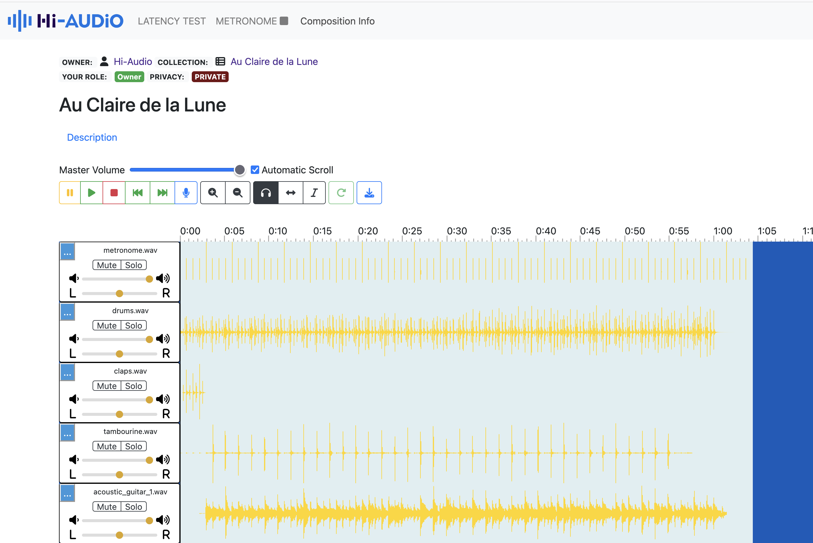

## About

Hi-Audio online platform is a collaborative web application for musicians and researchers in the MIR (Music Information Retrieval) domain. It allows:

- Creating musical compositions and collections with different levels of privacy.
- Uploading and recording audio tracks from the browser.
- Annotating audio tracks with relevant MIR information.
- Inviting collaborators to participate using different roles.

## How to run it locally:

Requirement: Node.js v14 or above
**NOTE: currently this project needs from the backend to be running in parallel.**
First clone and run backend repo. Backend can be found at: https://github.com/idsinge/hiaudio_backend

0. `nvm use 14` In case you have problems with Node versions (https://github.com/nvm-sh/nvm)

1. **Inside backend folder repo clone hiaudio webapp**: `git clone https://github.com/idsinge/hiaudio_webapp.git`
2. `cd hiaudio_webapp` (Rename folder to `webapp`)
3. `npm i`
4. Duplicate and rename `src/common/js/config_template.js` to `src/common/js/config.js`. See `Note 1`.
5. `npm run dev`
7. Open `https://localhost:7007/`. For HTTP see `Notes 2 and 3`.
8. To build a new version for backend repo, run the command `npm run build` and the sources will be placed at `public` folder.

#### NOTES:
1. For a different endpoint change `MODE=DEV` at `config.js`. `DEVPORT` is `7007` by default.
2. For http remove the `--https` param in `package.json`: `... --port 8000 --https"`
3. Webapp local dev version does not work isolated, it means without server instance.

## More info:

- ISMIR 2024: https://ismir2024program.ismir.net/lbd_448.html

- Hi-Audio Project: https://hi-audio.imt.fr/2025/03/07/bridging-music-and-research/

- How to: https://hiaudio.fr/static/howto.html

## Acknowledgements:
<!-- prettier-ignore-start -->
<!-- markdownlint-disable -->
<table>
  <tr>
    <td align="center"><a href="https://github.com/naomiaro"> <b>Naomi Aro</b></a> <a href="https://github.com/naomiaro/waveform-playlist" title="Code">waveform-playlist</a></td> 
  </tr>
</table>
<!-- markdownlint-enable -->
<!-- prettier-ignore-end -->
