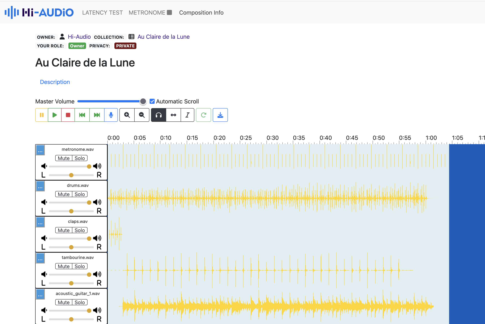

# Hi-Audio Web Application

## About

Hi-Audio online platform is a collaborative web application for musicians and researchers in the MIR (Music Information Retrieval) domain, with a view to build a public database of music recordings from a wide variety of styles and different cultures. It allows:

- Creating musical compositions and collections with different levels of privacy.
- Uploading and recording audio tracks from the browser.
- Annotating audio tracks with relevant MIR information.
- Inviting collaborators to participate using different roles.



This repo contains information relative to the client side or front-end, for the server side (backend API) check the following repo:

https://github.com/idsinge/hiaudio_backend

## How to run it locally

Requirement: Node.js v14 or above

Install Node.js: https://nodejs.org/en/download

Recommendation: in case you have problems with Node versions use [NVM](https://github.com/nvm-sh/nvm). NVM may be required to develop features for `waveform-playlist`. See `Note 4`.

**IMPORTANT: currently this project needs from the backend to be running in parallel. See Note 3.**

First clone and run backend repo. More info at: [Working with frontend and backend at the same time](https://github.com/idsinge/hiaudio_backend/wiki/Working-with-the-frontend-and-backend-at-the-same-time-for-development)

1. **Inside backend folder repo clone hiaudio webapp**:

`git clone https://github.com/idsinge/hiaudio_webapp.git`

2. `cd hiaudio_webapp`
3. `npm i`
4. `npm run dev`
5. Open `https://localhost:7007/`. See `Note 1` to use port `8000`. For HTTP see `Note 2`.
6. To build a new version for backend repo, run the command `npm run build` and the sources will be placed at `../public` folder.


#### Notes
1. For a different endpoint change `MODE=DEV` at `config.js`. By default port for development is `7007` when the backend is running, otherwise the application can be open from `https://localhost:8000/` for pure frontend development when access to either API or DB is not required.
2. For http remove the `--https` param in `package.json`: `... --port 8000 --https"`
3. Webapp local dev version does not work isolated, it means without server instance. It can be used to point prod server and check info available there, but for full authenticated API methods the backend is required.
4. To work with `waveform-playlist` repo for development check the following documentation:

https://github.com/idsinge/hiaudio_webapp/wiki/Running-waveform%E2%80%90playlist-for-development

## More info

- [ISMIR 2024](https://ismir2024program.ismir.net/lbd_448.html)

- [Hi-Audio Project](https://hi-audio.imt.fr/2025/03/07/bridging-music-and-research/)

- [How to](https://hiaudio.fr/static/howto.html)


## Contributing

Contributions are welcome! If you find a bug or have a feature request, please open an issue on [GitHub](https://github.com/idsinge/hiaudio_webapp/issues).

If you would like to contribute code, please fork the repository and submit a pull request. For major changes, open an issue first to discuss what you would like to change.

For any other enquiries, feel free to contact the maintainers.

---

## Acknowledgements

The Hi-Audio platform is developed as part of the project *Hybrid and Interpretable Deep Neural Audio Machines*, funded by the **European Research Council (ERC)** under the European Union's Horizon Europe research and innovation programme (grant agreement No. 101052978).


We also thank [Naomi Aro](https://github.com/naomiaro) (@naomiaro) for publishing and maintaining the [waveform-playlist](https://github.com/naomiaro/waveform-playlist) repository (version [v4.3.3](https://github.com/naomiaro/waveform-playlist/tree/v4.3.3) used in this project).

<!-- prettier-ignore-start -->
<!-- markdownlint-disable -->
<table>
  <tr>
    <td align="center"><a href="https://github.com/naomiaro"><br /><sub><b>Naomi Aro</b></sub></a><br /><a href="https://github.com/naomiaro/waveform-playlist" title="Code">waveform-playlist</a></td> 
  </tr>
</table>
<!-- markdownlint-enable -->
<!-- prettier-ignore-end -->

---

## How to Cite

If you use or reference the data or findings from this repository, please cite the published journal article. You may also cite the repository directly.

> Gil Panal, J. M., David, A., & Richard, G. (2026). The Hi-Audio online platform for recording and distributing multi-track music datasets. *Journal on Audio, Speech, and Music Processing*. https://doi.org/10.1186/s13636-026-00459-0

**BibTeX:**

```bibtex
@article{GilPanal2026,
  author  = {Gil Panal, Jos{\'e} M. and David, Aur{\'e}lien and Richard, Ga{\"e}l},
  title   = {The Hi-Audio online platform for recording and distributing multi-track music datasets},
  journal = {Journal on Audio, Speech, and Music Processing},
  year    = {2026},
  issn    = {3091-4523},
  doi     = {10.1186/s13636-026-00459-0},
  url     = {https://doi.org/10.1186/s13636-026-00459-0}
}
```

A preprint version is also available at: [https://hal.science/hal-05153739](https://hal.science/hal-05153739)

**Repository citation:**

> Gil Panal, J. M., David, A., & Richard, G. (2026). *Hi-Audio Web Application* [Software repository]. GitHub. https://github.com/idsinge/hiaudio_webapp

```bibtex
@misc{GilPanal2026webapp,
  author = {Gil Panal, Jos{\'e} M. and David, Aur{\'e}lien and Richard, Ga{\"e}l},
  title  = {Hi-Audio Web Application},
  year   = {2026},
  url    = {https://github.com/idsinge/hiaudio_webapp}
}
```

---

## License

This project is licensed under the [MIT License](LICENSE.md).  
Copyright (c) 2022 Hi-Audio.
